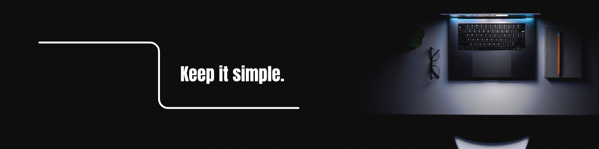

 

  

---

  

---

## 👨‍💻 About Me

I’m an MCA student passionate about Data Science & Analytics, with a strong interest in turning raw data into meaningful insights. I enjoy working on real-world datasets, performing exploratory data analysis, and building structured data projects using Python and SQL. I’m continuously improving my analytical thinking, statistics, and machine learning fundamentals. Outside of data, I’m a huge Formula 1 fanatic who loves analyzing race strategies and performance stats, and I enjoy playing chess and video games in my free time.

---

  

---

## ⚙️ Core Skills

---

## 💻 Other Tools and Technologies

---

## 📊 Featured Kaggle Datasets

🚗 **Electric Vehicle Specs Dataset** - 478+ EV Models Scraped & Structured  
₿ **Daily Crypto Market Tracker** - Automated API-based Time-Series Dataset  
🏎 **Ferrari Images Dataset** - High-Resolution Image Collection  
🌍 **Global Freelancers Dataset** - NLP & Data Cleaning Ready Dataset  
🧱 **Minecraft Block Textures Dataset** - Image + Metadata Dataset  

🔗 Kaggle: [urvishahir](https://www.kaggle.com/urvishahir) 
🔗 HuggingFace: [UrvishAhir1](https://huggingface.co/UrvishAhir1)

 

---

## 🎮 Contribution Activity

<picture>
  <source media="(prefers-color-scheme: dark)" srcset="https://raw.githubusercontent.com/UrvishAhir1/UrvishAhir1/output/pacman-contribution-graph-dark.svg">
  <source media="(prefers-color-scheme: light)" srcset="https://raw.githubusercontent.com/UrvishAhir1/UrvishAhir1/output/pacman-contribution-graph.svg">
  
</picture>

---

## 📫 Connect With Me

🔗 Email: [urvishahir7@gmail.com](mailto:urvishahir7@gmail.com)  
🔗 LinkedIn: [linkedin.com/in/urvishahir1](https://www.linkedin.com/in/urvishahir1/)  
🔗 X (Twitter): [x.com/IAmUrvishAhir](https://x.com/IAmUrvishAhir)  
🔗 Linktree: [linktr.ee/urvishahir1](https://linktr.ee/urvishahir1)

---

  

